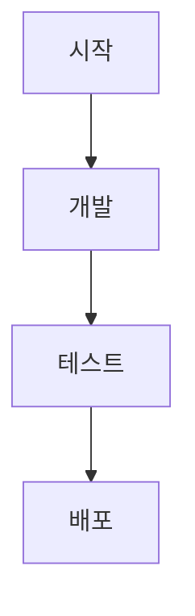

# Quarkus 프로젝트 시작! (학번 : 20250615  이름 :오다혜 )
매 주 수업 내용을 요약, 실습 사진 첨부, 교수님 추가구현 꼭 봐주세요! 열심히 했어요!
<br>
<br>
## 1주차 수업 내용
- 개발 환경: Visual Studio Code + Quarkus Tools 확장, Git Hub(소스코드관리+기말 보고서), JDK17 or 21
- AI 도구 : 필수 Google Geminai 
<br>
<br>

## 2주차 수업 내용
- 트렌드 이론분석: AI agent를 통한 저코드/노코드 지향, 인기도 제미나이 vs claude 양자구도,가상화 발전 방향성

### 실습 1 : Quarkus 개발 환경 구축
[노션- 2주차 Quarkus 환경구축 자체 메뉴얼](https://www.notion.so/2-32c685f6762580c39009d41d069e7256?source=copy_link)
재설치 혹은 학우들과 공유하기 위하여 노션으로 '설치 절차+오류대처'를 작성

**Quarkus 프로젝트 기본 명령어**
- 실행: ./mvnw quarkus:dev 
- 종료: ctrl + c, q
- 웹페이지 열기: w,  http://localhost:8080 로 접속

### 실습 2 : 터미널을 통한 Quarkus 실행과 index.html 파일의 조작을 통한 웹화면 구현 기초.
<div align="center">


</div>
<br>
<br>


## 3주차 수업 내용
- 트렌드 이론분석: 프론트의 방향(인터렉티브&몰입형 경험), 백엔드의 방향(웹 3.0의 현실화), 개발 환경의 변화(바이브 코딩), 개발 전용 AI도구(AI Agent) 

### 실습 1 : 사이버 캠퍼스에서 다운로드 받은 index.html를 사용하여 html의 구조와 부트스트랩 5이해하기
<div align="center">

</div>

### 실습 2 : League Of Legends 홈페이지에서 F12-Elements에서 코드 해석해보기
<div align="center">

</div>

### 실습 3 : 호버 전환 효과를 확인하고 속성값을 수정해보기
<div align="center">

</div>

### 실습 4 : 깃 설치, 깃허브 연동 후 스테이징-커밋-푸시 작업. readme.md 작성 후 push하기
<div align="center">

</div>

### 이론 학습 : 
- 기본 골격: 타이틀, 헤더, 네비게이션 바, 메인(본문)
- 태그: h1, p, li, div
- style : 안에서 시각적인 다양한 설정이 가능함
<br>
<br>


## 4주차 수업 내용

### HTML 실습
- 부트스트랩 문서로 여러 기능 찾아보기
- 하이퍼링크로 이미지 가져오기/ 상대 주소로 로컬이미지 가져오기
<div align="center">

</div>

- html을 F12 로 개발자모드 분석하기
- 네비게이션 바 수정해보기
- 그리드 방식 비교해보기
- 챔피언 카드를 수정하고 모달창 구현해보기

<br>
<br>

## 5주차 수업 내용

### 서브페이지 구현하기
- 메인페이지와 download 페이지 연동하기(네비게이션 바 가져오기)
- download.css 파일로 디자인 규격 설정하는 속성 조정하기
- 다운로드 버튼에 다운로드 파일 링크 추가하기
- 베너 이미지 추가하기
- 표 추가하기

<div align="center">

</div>

<br>

### 과제
- 네비바 안에 리그오브레전드 로고 삽입
- 네비바 가운데 정렬
- 2025년 이후 신규 챔피언 멜, 유나라, 자헨 챔피언카드 추가
<div align="center">

</div>
<div align="center">

</div>

<br>
<br>


## 6주차 수업 내용

### 실습
- JS 적용해보기
<div align="center">

</div>
<div align="center">

</div>


- 검색창 구현하기
<div align="center">

</div>
<div align="center">

</div>


### 자바 스크립트 기초

| 구분 | 스코프 차이 | 재선언 | 재할당 | 호이스팅 | 
| :---: | :---: | :---: | :---: | :---: |
|var| 함수 스코프 | 가능 | 가능 | O(undefined로 초기화) |
|let| 블록 스코프 | 불가능 | 가능 | O (TDZ 발생) |
|const| 블록 스코프 | 불가능 | 불가능 | O (TDZ 발생) |


<br>
<br>

## 7주차 수업 내용

- search.js의 코드 분석해보기

- search 기능을 구글이 아니라 웹사이트 내부 검색으로 제작

- 스타일 부분을 <link rel="stylesheet" href="css/main.css"> 를 통해 외부로 연동해서 정리함

- 폼 이벤트가 작동하는 방식 학습

- 카테고리 전환 함수의 작동 방식 학습

### 과제

- 데이터 정의 추가: 유나라 멜 자헨이 검색 가능하도록 변경 (search.js에 내용 추가)

<div align="center">


</div>

- 검색어 기능 추가: search.js에 검색내용이 없을 때 메인화면으로 돌아가는 기능 구현(showMainScreen 함수)

<br>
<br>

---

<br>
<br>

<details>

<summary> 중간고사 내용 정리 </summary>

### 태그/속성 총 정리 
태그 사용법 : `<태그 속성="[https://google.com](https://google.com/)">내용</태그>`
| 분류 | 태그명 | 풀네임 | 기능설명 |
| :--- | :--- | :--- | :--- |
| 문서 구조 | `<!DOCTYPE>` | Document Type Declaration | 문서 형식을 정의한다. 브라우저에 HTML5 문서임을 선언한다. |
| 문서 구조 | `<html>` | HyperText Markup Language | 모든 HTML 요소의 최상위 컨테이너이다. 웹 문서의 시작과 끝을 알린다. |
| 문서 구조 | `<head>` | Header Information | 브라우저 화면에 보이지 않는 메타데이터(설정 값), 문서 제목, 스타일 시트 등을 담는다. |
| 문서 구조 | `<meta>` | Metadata | 문자 인코딩(`charset`), 화면 배율(`viewport`), 검색 엔진 최적화 정보 등을 정의한다. |
| 문서 구조 | `<title>` | Document Title | 브라우저 상단 탭에 표시되는 제목을 설정한다. |
| 문서 구조 | `<body>` | Body Content | 사용자에게 실제로 보이는 모든 콘텐츠(텍스트, 이미지, 버튼 등)를 작성하는 공간이다. |
| 텍스트 콘텐츠 | `<h1>` | Heading Level 1 | 문서 내에서 가장 중요한 제목을 정의한다. 숫자가 커질수록 중요도는 낮아진다. |
| 텍스트 콘텐츠 | `<p>` | Paragraph | 일반적인 텍스트 문단을 구분할 때 사용한다. 위아래로 약간의 여백이 생겨 간격을 조절한다. |
| 텍스트 콘텐츠 | `<code>` | Computer Code | 프로그래밍 코드나 경로명을 나타낼 때 사용하며, 보통 고정폭 글꼴로 렌더링된다. |
| 텍스트 콘텐츠 | `<ul>` | Unordered List | 순서가 없는 목록을 생성한다. 항목 간의 우선순위가 없을 때 사용한다. |
| 텍스트 콘텐츠 | `<li>` | List Item | `<ul>` 혹은 `<ol>` 태그 안에 들어가는 개별 항목이다. 단독으로 쓰이지 않는다. |
| 미디어 | `` | Image | 웹 페이지에 이미지를 삽입한다. 클래스 속성을 추가하여 디자인 틀에 맞춰 크기를 제어할 수 있다. |
| 레이아웃 | `<div>` | Division | 특별한 의미 없이 구역을 나누거나 요소를 그룹화하는 컨테이너이다. 레이아웃을 잡거나 CSS 디자인을 입힐 때 핵심 요소가 된다. |
| 레이아웃 | `<nav>` | Navigation | 상단 메뉴나 링크 모음 구역을 나타내는 의미론적 태그이다. 웹사이트의 길잡이 역할을 하는 메뉴바를 만들 때 사용한다. |
| 외부 리소스 | `<link>` | External Link | 외부 CSS 파일(Bootstrap 등)을 가져와 현재 문서에 적용한다. `<head>` 내부에 작성한다. |


- href는 Hypertext REFerence(하이퍼텍스트 참조)의 약자

- rel은 Relationship(관계)의 약자 라벨링을 해준다

- 외부파일 연결법 :\<script src=”파일위치”\>\</script\>

---
| 구분 | var | let | const |
| :--- | :--- | :--- | :--- |
| 도입 시기 | ES5 (기존) | ES6 (2015) | ES6 (2015) |
| 재선언 | 가능 | ❌ 불가능 | ❌ 불가능 |
| 재할당 | 가능 | 가능 | ❌ 불가능 |
| **스코프(scope)** | **함수 스코프** | **블록 스코프** | **블록 스코프** |
| 호이스팅 | O (undefined로 초기화) | O (TDZ 발생) | O (TDZ 발생) |
| 초기화 필수 여부 | 선택 | 선택 | ✅ 필수 |

- 재선언: 같은 이름의 변수 바구니를 또 만드는 것이다. (var a = 1; var a = 2;) var는 이것을 허용하기 때문에 코드가 길어지면 변수 이름이 겹쳐서 치명적인 버그가 발생하기 쉽다.

- 재할당: 바구니 안에 들어있는 내용물을 바꾸는 것이다. const는 상수(Constant)이기 때문에 처음에 값을 한 번 넣으면 이후에 절대 다른 값으로 덮어쓸 수 없다. (따라서 선언과 동시에 값을 넣는 '초기화'가 필수이다.)

- 스코프 (Scope: 변수의 생존 범위)

- 호이스팅 (Hoisting) 코드가 실행되기 전에 변수 선언이 문서의 최상단으로 끌어올려지는 것처럼 동작하는 자바스크립트 특유의 현상
---
- DOM'문서 객체 모델': 브라우저가 HTML 문서를 읽어 들일 때, 이를 단순한 글자로 놔두는 것이 아니라 자바스크립트가 이해하고 제어할 수 있는 '객체(Object)' 형태로 변환하여, 위에서 아래로 뻗어 나가는 '트리(Tree) 구조'로 만들어 놓은 것

- id는 DOM 트리 안에 있는 수많은 객체(Node)들 중에서 특정 객체를 유일하게 식별해 내는 '고유 구분자(Identifier)' 역할
---
### 이벤트 처리방식
| 방식 | 작성 예시 | 특징 |
| :--- | :--- | :--- |
| **인라인 (Inline)** | `<button onclick="alert('안녕')">` | HTML 태그 안에 직접 작성. 관리가 어렵고 보안상 권장되지 않음. |
| **프로퍼티 (Property)** | `element.onclick = function() { ... }` | JS에서 HTML 요소를 가져와 연결. 한 요소에 하나의 이벤트만 할당 가능. |
| **이벤트 리스너 (Listener)** | `element.addEventListener('click', ...)` | 권장 방식. 여러 개의 함수를 등록할 수 있고 제어가 유연함. |

<br>
<br>

| 구성 요소 | 역할 | 해당 코드에서의 동작 |
| :--- | :--- | :--- |
| Call Stack | 현재 실행 중인 함수를 기록 | preventDefault, trim, window.open 등이 차례로 쌓이고 실행됨 |
| Web APIs | 브라우저 제공 기능 (DOM, Timer, Network) | submit 이벤트 감시, 새 창 열기(window.open) 처리 |
| Task Queue | 실행 대기 중인 콜백 함수 저장소 | 클릭(제출) 발생 시 실행될 익명 함수가 여기서 대기 |
| Event Loop | Stack과 Queue 사이의 교통 정리 | Stack이 비면 Queue의 함수를 Stack으로 전달 |

---
- 일반 변수(하나의이름 하나의 값) 
- 일반 배열(여러값, 인덱스로 접근) 
- 객체배열(여러 속성을 가진 객체들의 나열, 키 값)

</details>


<br>
<br>

---

<br>

## 9주차 수업 내용
- **자바스크립트 기초**
자바스크립트 자료구조: 검색이나 필터링해야할때는 객체배열을 쓰자,

### 다크모드 / 라이트 모드 전환

- **HTML 토글 버튼 추가**

    링크에서 버튼교체, onclick="toggleTheme() 으로 클릭을 받아 js 메소드를 씀
    main.css를 수정해서 토글버튼 디자인 설정해주기
- **CSS에 버튼과 라이트모드 스타일 추가**
    -순서 작동 숙지하자: !important->인라인 ->Id스타일->클래스 스타일->타입스타일
    -토글버튼이나 다른부분에 이모지가 다 안들어가네, 따로 구해보자

- **JS 토글 함수로 다크/라이트 모드 전환 구현**

<table align="center">
  <tr>
    <td></td>
    <td></td>
  </tr>
</table>

### 데이터 베이스 연동과 준비작업

- 자바 소스코드 위치: java\org\acme
src\main\java\org\acme\GreetingResource.java
테스트할때 쓰는 쿼크스에서 제공해주는거
=> localhost:8008/hello 하면 문구가 나온다
@Path("/hello") : 어노테이션, /hello경로 지정
@GET : 어노테이션 /hello요청이 오는것을 보고 메서드 아래 실행하게됨

|항목|Java|JavaScript|
|:---|:---|:---|
|실행방식|컴파일|인터프리터|
|타입시스템|정적타입|동적타입|
|용도|벡엔드,DB제어,데이터가공, 앱|웹 프론트엔드, 풀스텍|


- MYSQL 설치: community버전 https://dev.mysql.com/downloads/installer/

|명령어|내용|
|:--|:--|
|show databases;|DB 목록 확인|
|create database lol;|새로운 DB생성|
|show tables;|테이블 보기|


<table align="center">
  <tr>
    <td></td>
    <td></td>
  </tr>
</table>

- db테이블 확인 http://localhost:8080/q/dev/ -> database view

- mysql과 orm드라이버등 추가할려고 pom.xml파일 속 <dependencies> 하위에 코드 삽입

- DataSeeder.java에 persist로 챔피언들 기본 값을 넣어주는 코드 작성

- database에서 구현할때 최소한 기능을 분해하여 3파일이상으로 쪼개 놓음


<br>
<br>

## 10주차 수업 내용
### 트랜드 이론 분석
- 웹 보안의 인증방식: 세션 쿠키방식(쿼크스), http프로토콜(무상태)

### 로그인 기능 구현
- 메인화면에 로그인 버튼 /login으로 연결
- login.html로 로그인 페이지 작성
- 로그인 체크 기능, 로그인후 로그아웃 버튼이 있는 페이지 작성
- 세션 체크로 로그인 후 페이지, 로그아웃으로 세션 초기화 후 메인이동
<table align="center">
  <tr>
    <td></td>
    <td></td>
    <td></td>
  </tr>
</table>


<br>
<br>

## 11주차 수업 내용
### 회원가입 기능

- 회원가입 버튼 추가
- 회원가입 화면 register.html 작성
- inputcheck.js로 입력값 유효성 검사
<table align="center">
  <tr>
    <td></td>
    <td></td>
    <td></td>
  </tr>
</table>

### 암호화
- SHA-256 해시 처리: input_sha256.js
- 모달창 구현

<table align="center">
  <tr>
    <td></td>
    <td></td>
    <td></td>
  </tr>
</table>

<br>
<br>

## 12주차 수업 내용
### 로그인/ 메인화면
- 기존 guest 삭제
- 새로 guest 등록
<div align="center">

</div>
- 메인페이지 index-> main_index로 변경

### 프로필 페이지
- 네비바에 프로필 링크 추가
- Authresource.java에서 /profile 엔드포인트를 등록(세션x 로그인으로 돌려보내기, 세션o profile.html)
- User.java 에 프로필사진에 대한 열 추가
- profile.html profile.js 작성
- 업로드 엔드포인트 수정
<table align="center">
  <tr>
    <td></td>
    <td></td>
  </tr>
</table>


## 13주차 수업 내용
### 프론트 수정
- 브라우저 알림창 Toast로 수정
- 네비바의 profile.js 수정하여 사용자명 동적 표시
### 회원정보 수정 
- 회원정보 수정 폼 추가하기
- 비밀번호 변경 폼 추가(회원정보 토글안에 같이 잘 위치시키기)
- 변경 성공 Toast 처리 (완료후 로그인페이지 이동)
- input_sha256 연동 누락하여 비밀번호 변경 버튼 작동안함 -> 수정 완

<table align="center">
  <tr>
    <td></td>
    <td></td>
    <td></td>
    <td></td>
  </tr>
</table>


## 기말고사

## 과제들
- [x] 3w 상단 좌측 로고(네비바 안 LOL로고)


- [x] 3w 네비바 가운데 정렬

- [x] 3w 챔피온 카드(상세정보 모달 구현)

- [x] 6w 데이터 정의 추가
    -새로 추가한 챔피온 데이터 3개이상
    -검색어 창에 키워드로 이름 입력
    -정상겁색 및 화면 출력
- [x] 6w 검색어 기능 추가
    -검색어가 없거나 공백인 경우 메인화면으로 돌아가기
    -showMainScreen()함수를 만든다(performSearch에서 q가 없으면 호출 :조건)
    -클릭->기존 secthon이 다시 보임

- [x] 9w 챔피온 검색 결과
- [x] 9w 자바스크립트 호출방식 변경하기
    -기존 토글 함수를 인라인->리스너 방식으로 변경(클릭하면 toggle 함수 실행)
- [x] 9w 모든 페이지 동일 적용하기
    -다운로드 페이지 적용
    -다크/라이트 모드 공통 적용
- [x] 10w 로그인 페이지의 다크/라이트 모드를 구현
    -문제점: 구버전 네비바, 다크/라이트 모드 작동 x
    -기존 index.html 재활용(네비바, css코드)

- [x] 11w 로그인 화면 입력값 체크
    -회원가입 register.html 화면의 입력값 체크
    -동일하게 JS 정규식 체크 구현
- [x] 11w Js 폴더에 login.js를 생성하고 작성한다.
    -validateAndLogin() 함수를 구현한다.(기존 input_check.js를 참고한다.
)

- [x] 11w Login 폴더에 login.html도 수정한다
    -현재 아이디, 패스워드 필드에 id가 있는가?
- [x] 12w 로그인 에러처리
    -로그인 에러 시 오류 메시지 없음
     login.js의 하단에 window.onload 함수를 추가한다
     로그인 실패 시 오류 메시지를 표시하시오.
- [x] 12w 업로드 에러 처리
    -사진 업로드에 대한 오류 메시지 없음
     profile.html 파일 업로드 폼 위에 div 추가
     profile.js window.onload 에 추가


- [x] 13w 모든 페이지 검색창 동작

- [x] 13w Js 로드 순서 확인, 상대경로 확인

- [x] 13w 네비게이션 바 통일

- [x] 13w 하이퍼 링크 체크(상대경로 체크)

- [x] 13w 전체 페이지 다크/라이트 모드 통일

- [x] 13w 자바 자바스크립트 코드 체크
    -들여쓰기 불필요한 코드 중복
    -코드별 주석

## 추가 구현
- [x] 챔피온 이미지를 원하는 이미지로 바꾸기(그림판에 직 접 그렸습니다.)
<div align="center">

</div>
- [x] 최신뉴스에 이미지와 실제 리그오브레전드 패치노트 등록하고 더보기하면 실제 리그오브레전드 사이트의 공지사항으로 넘어가게 링크 등록 
<div align="center">

</div>

- [x] 검색에 뉴스도 뜨도록 뉴스 등록
<div align="center">

</div>

- [x] 상세보기와 아트록스 다크/라이트 모드 적용(수정), 다른 챔피언에도 상세보기 추가
<table align="center">
  <tr>
    <td></td>
    <td></td>
    <td></td>
  </tr>
</table>

- [x] 메인 홈에 영상넣는게 멋있어보여서 비디오를 추가함(롤 공식 시네마틱 영상 녹화해서 mp4형식으로 삽입), 가독성을 위해 오버레이로 누름
<div align="center">

</div>

- [x] 뉴스 페이지 구현
<div align="center">

</div>

- [x] 챔피온 페이지구현 + 챔피온 분류별로 보는 기능(롤 공식 홈페이지의 기능 참고)
<table align="center">
  <tr>
    <td></td>
    <td></td>
  </tr>
</table>


## 트러블슈팅(Troubleshooting)

- [X] Toast 구현을 위해 HTML도 바꾸고 test.js도 수정했는데 작동안함
->   ` <script src="../js/test.js"></script>`를 추가해줌

- [ ] ppt의 이모지들이 복사가 안되어서 전반적으로 통일감있게 수정필요->이모지 포기

- [x] 프로필 말풍선 tooltip 구현하려고 했으나 말풍선이 안뜸 -> 토스트와의 충돌이라는것을 알아냄 ->
    window.onload 를 아래의 코드로 바꿔서 수정
    `window.addEventListener('load', function() { fetch('/profile/info')... });`

- [x] 프로필 내용 수정 후 토스트? 확인창이 안뜸, 전체화면에서 화면 비율이 이상함 

- [x] 다운로드 창에서 로그인세션이어도 로그아웃버튼이 안뜸->수정 완

<br>
<br>


### 모르겠는것들
- [x] `<script src="js/test.js"></script>` 의 적는 위치 규칙, 순서
    
- [x] @get, @post 형식은 알겠는데 보내고 받는 주체가 뭔지 모르겠음
        ->브라우저에서 get요청이 오면 @get이 반응한다! OK 이해완료


# Readme.md 꾸미기 메모
- 이미지 첨부하기
```markdown
<div align="center">

</div>

```

- 이미지 그리드 배치
```markdown
<table align="center">
  <tr>
    <td></td>
    <td></td>
    <td></td>
  </tr>
</table>
```


- 코드블록으로 mermaid 다이어그램 플로우차트 만들기




- 코드를 짧게 언급할 때는 \` \`를 통해서 감싸주자

- VSCode 확장 "Markdown Preview Enhanced" 설치=> 미리보기가 내장은 별로여서 설치했다